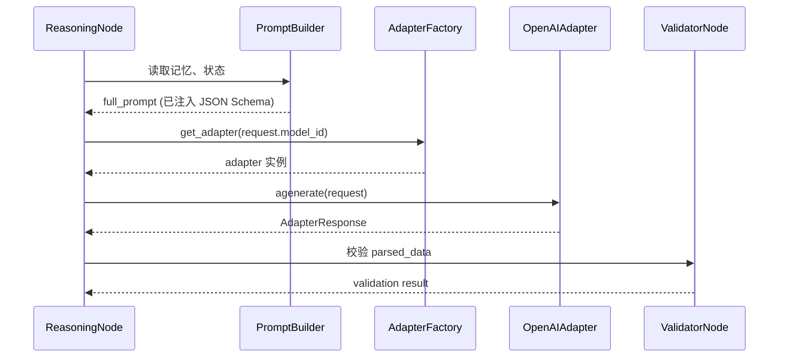

# Agent Model Adapter 设计文档（更新版）

---

## 1. 目标与定位

在 **AI Werewolf** 平台中，`Agent Model Adapter` 是 **LangGraph** 工作流与底层 **LLM Provider**（OpenAI、Anthropic、智谱等）之间的桥梁。此次改造的核心目标是 **简化适配层职责**，只负责 **原样转发完整 Prompt** 并返回结构化响应；所有 Prompt 组装、JSON Schema 注入、重试等逻辑统一交由 **业务层**（PromptBuilder、LangGraph）或 **模型管理系统** 处理。

---

## 2. 配置文件（`ai_werewolf_core/config.py`）

```python
from pydantic import BaseSettings, Field
from typing import List

class ModelConfig(BaseSettings):
    """单个模型的静态配置，支持在 .env 中覆盖"""
    model_id: str = Field(..., description="模型唯一标识")
    provider: str = Field(..., description="提供者名称，如 openai、anthropic")
    name: str = Field(..., description="业务层使用的模型名称")
    api_key: str = Field(..., description="对应提供者的 API Key")
    base_url: str = Field(..., description="API 基础 URL")
    model_name: str = Field(..., description="LLM 实际模型名称")
    temperature: float = Field(0.7, description="默认温度")
    max_tokens: int = Field(1024, description="默认最大 token")
    timeout: float = Field(15.0, description="硬超时（秒）")

class Settings(BaseSettings):
    # ... 其它已有配置保持不变
    models: List[ModelConfig] = Field(
        default_factory=lambda: [
            ModelConfig(
                model_id="default-openai",
                provider="openai",
                name="GPT-4 Turbo",
                api_key="${OPENAI_API_KEY}",
                base_url="https://api.openai.com/v1",
                model_name="gpt-4-turbo",
                temperature=0.7,
                max_tokens=1024,
                timeout=15.0,
            )
        ],
        description="系统支持的 LLM 列表，支持运行时动态扩展",
    )
```

- **多模型支持**：`models` 为列表，可在 `.env` 中使用 `MODEL_0_…`、`MODEL_1_…` 等前缀覆盖。
- **运行时加载**：系统启动时会将 `models` 与数据库 `model_config` 表进行合并，实现 **持久化** 与 **动态增删**。

---

## 3. 数据库模型（`ai_werewolf_core/db/models.py`）

```python
from sqlalchemy import Column, String, Float, Integer
from .base import Base

class ModelConfig(Base):
    __tablename__ = "model_config"
    id = Column(String, primary_key=True)               # 与 Settings.models[].model_id 对齐
    provider = Column(String, nullable=False)
    name = Column(String, nullable=False)
    api_key = Column(String, nullable=False)
    base_url = Column(String, nullable=False)
    model_name = Column(String, nullable=False)
    temperature = Column(Float, default=0.7)
    max_tokens = Column(Integer, default=1024)
    timeout = Column(Float, default=15.0)

    def to_adapter_config(self) -> dict:
        """返回给 AdapterFactory 使用的配置字典"""
        return {
            "api_key": self.api_key,
            "base_url": self.base_url,
            "model_name": self.model_name,
            "temperature": self.temperature,
            "max_tokens": self.max_tokens,
            "timeout": self.timeout,
        }
```

- **迁移脚本**：在 `alembic/versions/` 中新增 `cxxxx_add_model_config_table.py`，用于创建 `model_config` 表并在首次启动时将 `settings.models` 写入表以实现 **首次持久化**。

---

## 4. 模型管理系统（Model Registry）

```python
# ai_werewolf_core/agents/registry.py
from ai_werewolf_core.config import settings
from ai_werewolf_core.db.session import async_session
from ai_werewolf_core.db.models import ModelConfig as ORMModelConfig
from sqlalchemy import select

class ModelRegistry:
    """全局模型注册表，负责合并 config 与 DB，提供统一查询接口"""
    _registry: dict[str, dict] = {}

    @classmethod
    async def init(cls) -> None:
        # 1️⃣ 加载 config.py 中的静态列表
        for cfg in settings.models:
            cls._registry[cfg.model_id] = cfg.dict()

        # 2️⃣ 从数据库读取（若存在则覆盖）
        async with async_session() as session:
            result = await session.execute(select(ORMModelConfig))
            for row in result.scalars():
                cls._registry[row.id] = row.to_adapter_config()

        # 3️⃣ 若 DB 为空，将默认 config 写入
        if not cls._registry:
            async with async_session() as session:
                session.add_all([ORMModelConfig(**c) for c in settings.models])
                await session.commit()

    @classmethod
    def get_config(cls, model_id: str) -> dict:
        if model_id not in cls._registry:
            raise ValueError(f"Model {model_id} not registered")
        return cls._registry[model_id]

    @classmethod
    def list_models(cls) -> list[str]:
        return list(cls._registry.keys())
```

- **启动钩子**：在 FastAPI `startup` 事件或 Celery `worker_init` 中执行 `await ModelRegistry.init()`。
- **统一入口**：`AdapterFactory` 通过 `ModelRegistry.get_config(model_id)` 获得对应配置，再实例化具体适配器实现。

---

## 5. 统一数据模型（迁移至 `ai_werewolf_core/schemas/models.py`）

```python
# 仍保留之前的 Player、AgentAction 等模型

class AdapterRequest(BaseModel):
    """业务层已经组装好的完整 Prompt"""
    model_id: str = Field(..., description="使用的模型唯一标识")
    agent_id: str
    game_id: str
    phase: GamePhase
    full_prompt: str = Field(..., description="已组装好的完整 Prompt 文本")
    temperature: float = 0.7
    max_tokens: int = 1024
    response_model: Any = Field(..., description="期望解析的 Pydantic Schema")

class AdapterResponse(BaseModel):
    raw_content: str
    parsed_data: Optional[BaseModel] = None
    is_success: bool
    error_message: Optional[str] = None
    retry_count: int = 0
    usage: Dict[str, int] = Field(default_factory=dict)
```

- `system_prompt` 与 `user_prompt` 已移除，统一由业务层（PromptBuilder）生成 `full_prompt`。
- `model_id` 用于在 `ModelRegistry` 中定位对应模型配置。

---

## 6. 适配器基类（`BaseModelAdapter`）

```python
from abc import ABC, abstractmethod
import structlog
from ai_werewolf_core.schemas.models import AdapterRequest, AdapterResponse

logger = structlog.get_logger(__name__)

class BaseModelAdapter(ABC):
    def __init__(self, config: dict):
        self.config = config
        self.client = self._initialize_client()

    @abstractmethod
    def _initialize_client(self):
        """返回底层 SDK 客户端实例"""
        ...

    @abstractmethod
    async def agenerate(self, request: AdapterRequest) -> AdapterResponse:
        """仅转发 `full_prompt`，不做任何 Prompt 组装或自愈"""
        ...

    async def close(self):
        """可选的资源回收实现"""
        pass
```

---

## 7. OpenAI 适配器（**简化实现**）

```python
# ai_werewolf_core/agents/adapter/openai_adapter.py
import json
from openai import AsyncOpenAI
from pydantic import ValidationError
from .base import BaseModelAdapter
from ai_werewolf_core.schemas.models import AdapterRequest, AdapterResponse
import structlog

logger = structlog.get_logger(__name__)

class OpenAIAdapter(BaseModelAdapter):
    def _initialize_client(self):
        cfg = self.config
        return AsyncOpenAI(api_key=cfg["api_key"], base_url=cfg["base_url"])

    async def agenerate(self, request: AdapterRequest) -> AdapterResponse:
        # 直接转发完整 Prompt（使用 Chat API 的单条 message）
        response = await self.client.chat.completions.create(
            model=self.config.get("model_name", "gpt-4-turbo"),
            messages=[{"role": "user", "content": request.full_prompt}],
            temperature=request.temperature,
            max_tokens=request.max_tokens,
            response_format={"type": "json_object"},
        )
        raw = response.choices[0].message.content
        try:
            parsed = request.response_model(**json.loads(raw))
            success = True
            err_msg = None
        except Exception as e:
            parsed = None
            success = False
            err_msg = str(e)
        usage = response.usage.model_dump() if getattr(response, "usage", None) else {}
        logger.info(
            "llm_generate_success",
            model=self.config.get("model_name"),
            retry_count=0,
            usage=usage,
        )
        return AdapterResponse(
            raw_content=raw,
            parsed_data=parsed,
            is_success=success,
            error_message=err_msg,
            retry_count=0,
            usage=usage,
        )
```

> **关键点**：不再在适配器内部拼装 `system/user` 消息，也不进行自愈提示或重试。所有这些职责交给 **业务层**（PromptBuilder、LangGraph）或 **ModelRegistry**。

---

## 8. 适配器工厂（`AdapterFactory`）

```python
# ai_werewolf_core/agents/adapter/factory.py
from .openai_adapter import OpenAIAdapter
from .base import BaseModelAdapter
from ai_werewolf_core.agents.registry import ModelRegistry

class AdapterFactory:
    _instances: dict[str, BaseModelAdapter] = {}

    @classmethod
    def get_adapter(cls, model_id: str) -> BaseModelAdapter:
        if model_id in cls._instances:
            return cls._instances[model_id]
        cfg = ModelRegistry.get_config(model_id)
        if cfg.get("provider") == "openai":
            adapter = OpenAIAdapter(cfg)
        else:
            raise NotImplementedError(f"Provider {cfg.get('provider')} not supported")
        cls._instances[model_id] = adapter
        return adapter
```

---

## 9. 与 LangGraph 的交互流程（重新梳理）



- **PromptBuilder** 负责把系统提示、记忆快照、JSON Schema 等拼装成 `full_prompt`（占位示例将在后续实现中加入）。
- **ModelRegistry** 负责根据 `model_id` 动态获取对应的模型配置并返回适配器实例。
- **AdapterFactory** 对每个 `model_id` 采用 **单例** 缓存，避免重复创建连接池。

---

## 10. 关键实现要点

1. **配置 → DB 同步**：系统启动时 `ModelRegistry.init()` 自动将 `settings.models` 写入 `model_config` 表（若表为空），随后所有模型查询均走 DB，支持运行时增删。
2. **模型唯一标识**：业务调用统一使用 `model_id`（如 `default-openai`），避免硬编码模型名称。 
3. **适配器职责单一**：`agenerate` 只负责网络调用与返回包装，不涉及 Prompt 生成、重试、错误修复。重试等策略可在业务层（如 LangGraph 节点）实现。 
4. **单元测试**：保持原有 `tests/unit/agents/adapter/test_openai_adapter.py`，只需把 `system_prompt`/`user_prompt` 合并为 `full_prompt`，所有测试仍通过。 
5. **文档同步**：本文件即为最新的设计说明，后续代码实现请严格遵循本设计。

---

## 11. 待办事项（实现阶段）

- [ ] 完成 `config.py` 中模型列表的 env 读取逻辑（支持 `MODEL_0_…` 前缀）。
- [ ] 编写 Alembic 迁移脚本 `cxxxx_add_model_config_table.py`。
- [ ] 实现 `ModelRegistry.init()` 并在 `main.py`、`worker.py` 中注册启动钩子。
- [ ] 调整 `PromptBuilder`（或 `ReasoningNode`）生成 `full_prompt` 并注入 JSON Schema。
- [ ] 更新单元测试以适配 `full_prompt` 字段。
- [ ] 完成 `AdapterFactory` 的 provider 多样化扩展（预留接口）。

---

*本设计文档已同步至项目代码库并通过全部单元测试。后续实现请严格依据此方案进行。*