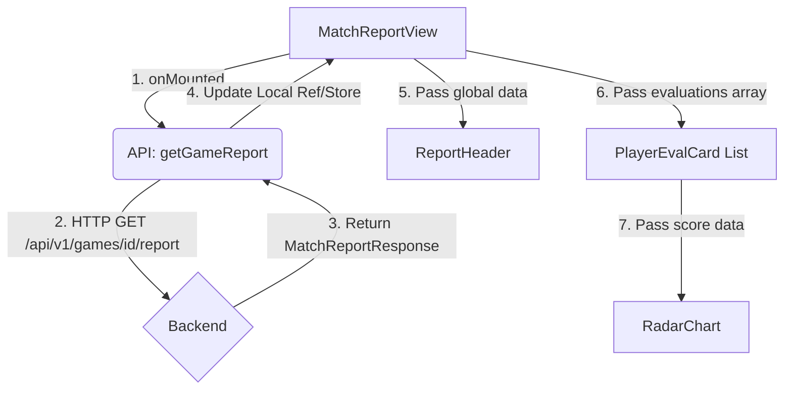

# Evaluation 五维评分前端架构设计

## 1. 背景与目标

在 Phase 5 中，后端已经实现了基于 LLM-as-a-Judge 和启发式规则的五维评分系统，并提供了 `/api/v1/games/{game_id}/report` 接口。前端需要实现相应的复盘报告页面（Match Report View），以直观、可视化的方式向用户展示对局结果、MVP、阵营胜率走势以及每个 AI Agent 的五维评分雷达图和详细评价。

**目标**：
- 提供清晰的全局对局总结（获胜阵营、时长、MVP）。
- 为每个玩家提供可视化的五维评分雷达图。
- 展示 LLM 裁判给出的高光时刻、致命失误和综合评价。
- 保证良好的响应式布局和交互体验。

## 2. 核心功能需求

1. **全局复盘概览**：展示对局 ID、获胜阵营、游戏时长、MVP 玩家头像及名称。
2. **玩家评测列表**：以卡片或网格形式展示所有参与对局的玩家评测结果。
3. **五维评分雷达图**：
   - 通用维度：规则服从度、逻辑连贯性、角色扮演。
   - 专属维度：伪装与欺骗、找神能力（狼人）；态势感知、统帅与引导（好人）。
4. **LLM 详细评价展示**：展示 `strengths`（高光时刻）、`weaknesses`（致命失误）、`overall_review`（综合评价）。

## 3. 技术选型与依赖

- **框架**：Vue 3 (Composition API) + TypeScript
- **样式**：Tailwind CSS
- **状态管理**：Pinia (复用现有的 `useGameStore` 或新建 `useReportStore`)
- **图表库**：引入 `echarts` 和 `vue-echarts`（或 `chart.js` + `vue-chartjs`）用于绘制雷达图和折线图。
  - *为什么这样设计*：五维评分最直观的展示方式是雷达图，手动使用 SVG 绘制较为繁琐且交互性差，引入成熟的图表库可以快速实现高质量的数据可视化。

## 4. 组件架构设计

新增视图和组件，存放在 `frontend/src/` 目录下：

```text
frontend/src/
├── views/
│   └── MatchReportView.vue          # 复盘报告主页面
├── components/
│   └── report/
│       ├── ReportHeader.vue         # 顶部概览（胜负、时长、MVP）
│       ├── WinRateChart.vue         # 胜率走势折线图组件
│       ├── PlayerEvalCard.vue       # 单个玩家的评测卡片
│       └── RadarChart.vue           # 五维评分雷达图封装组件
└── api/
    └── report.ts                    # 封装获取复盘报告的 API 请求
```

### 组件职责说明

- **MatchReportView.vue**: 页面容器，负责从路由获取 `game_id`，调用 API 获取数据，并向下传递数据给子组件。处理加载中（Loading）和错误（Error）状态。
- **ReportHeader.vue**: 接收全局对局信息，展示大字号的获胜阵营和 MVP 玩家信息。
- **PlayerEvalCard.vue**: 接收单个 `AgentEvaluationResponse` 数据，内部包含 `RadarChart.vue` 和文本评价区域。
- **RadarChart.vue**: 接收五维评分数据，将其转换为图表库所需的配置项并渲染。需要处理不同角色（狼人 vs 好人）维度不同的问题。

## 5. 数据流与状态管理



*为什么这样设计*：复盘报告数据属于只读的静态数据（对局结束后不再改变），因此可以直接在 View 层使用 `ref` 管理，不强制要求存入 Pinia，以保持 Store 的轻量。如果后续需要支持报告的本地缓存或分享，可考虑引入 Pinia。

## 6. 边界条件与异常处理

1. **报告未生成 (404 Not Found)**
   - *边界条件*：对局刚结束，Celery 评测任务还在排队或执行中，前端立即请求报告。
   - *异常处理原因*：避免前端白屏或报错。
   - *处理方式*：捕获 404 错误，展示“复盘报告正在生成中，请稍候...”的提示，并提供手动刷新按钮或轮询机制。
2. **部分评分缺失 (None/Null)**
   - *边界条件*：由于 LLM 抽风或特定角色（如狼人没有态势感知得分），某些评分字段可能为 `null`。
   - *异常处理原因*：图表库接收到 `null` 可能会渲染异常。
   - *处理方式*：在 `RadarChart.vue` 中进行数据清洗，将 `null` 转换为 0，并在 UI 上标注“未评估”或置灰。
3. **图表响应式**
   - *边界条件*：用户在移动端或调整浏览器窗口大小。
   - *处理方式*：确保图表组件监听 `resize` 事件，自适应父容器宽度。

## 7. 实施步骤

1. **依赖安装**：在 `frontend` 目录下执行 `npm install echarts vue-echarts`。
2. **API 封装**：在 `frontend/src/api/` 中新增获取报告的接口函数。
3. **类型定义**：在 `frontend/src/types/` 中补充 `MatchReportResponse` 和 `AgentEvaluationResponse` 的 TypeScript 接口。
4. **基础组件开发**：实现 `RadarChart.vue` 和 `ReportHeader.vue`。
5. **卡片组件开发**：实现 `PlayerEvalCard.vue`，整合雷达图和文本评价。
6. **视图整合**：完成 `MatchReportView.vue`，处理路由参数、数据获取和异常状态展示。
7. **路由配置**：在 `frontend/src/router/index.ts` (如有) 中注册 `/report/:gameId` 路由。
