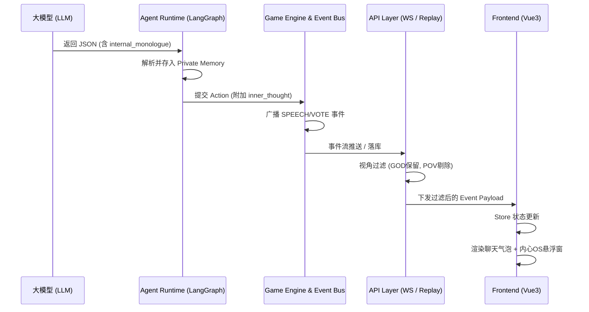

# 内心 OS (Inner OS) 透视系统代码架构方案

## 1. 系统概述
在纯 AI 对局或上帝视角（GOD Mode）观战中，展示 AI 玩家的“内心 OS（内部推理过程）”是本系统的核心高光功能。该功能允许观众在看到 AI 表面伪装发言的同时，洞察其真实的逻辑盘点和战术意图（如倒钩、悍跳等），从而直观展示大模型的思维链（CoT）能力。

## 2. 整体数据流转架构

数据从大模型生成到前端展示，经历以下四个核心阶段：

## 3. 核心模块详细设计

### 3.1 Agent Runtime 层 (数据源头)
*   **文件位置**: `ai_werewolf_core/agents/graph/nodes.py`
*   **核心逻辑**:
    *   在 `reasoning_node` 中，定义 `AgentResponseSchema`，强制 LLM 输出 `internal_monologue` 字段。
    *   解析 LLM 响应后，异步调用 `PrivateMemoryManager.save_reasoning()` 将内心 OS 持久化到 Redis，供后续轮次 RAG 检索使用。
    *   在构建最终的 `proposed_action` 时，将 `internal_monologue` 映射为 `inner_thought` 字段，附加到动作的 Payload 中。

### 3.2 Game Engine & Event Bus 层 (数据流转)
*   **文件位置**: `ai_werewolf_core/core/event/bus.py` & `ai_werewolf_core/schemas/models.py`
*   **核心逻辑**:
    *   引擎在处理 Agent 提交的 `Action` 时，提取 `inner_thought`。
    *   在生成 `SPEECH_EVENT` 或 `VOTE_EVENT` 等公开事件时，将 `inner_thought` 存入 `Event.payload` 字典中。
    *   事件通过 Event Bus 广播到 Redis Stream，并最终由后台任务异步落库到 PostgreSQL 的 `EventRecord` 表。

### 3.3 API 与网关层 (安全与视角隔离)
*   **文件位置**: `ai_werewolf_core/api/routes/replay.py` & `ai_werewolf_core/api/ws/manager.py`
*   **核心逻辑**:
    *   **回放接口 (`/api/replay/...`)**: 根据请求的 `perspective` 参数进行过滤。
        *   如果是 `GOD` 模式，直接下发完整的 payload。
        *   如果是 `POV` 模式，遍历事件列表，若 `event.actor_id != current_user_id`，则执行 `del payload["inner_thought"]`，防止玩家抓包作弊。
    *   **WebSocket 实时推送**: 在向特定 Client 推送事件前，根据该 Client 绑定的玩家身份（或观战身份）执行相同的视角过滤逻辑。

### 3.4 前端展示层 (UI 渲染)
*   **文件位置**: `frontend/src/components/InnerOSPanel.vue` (待新建/完善) & `frontend/src/views/ReplayView.vue`
*   **核心逻辑**:
    *   **状态管理 (`store/game.ts` / `store/replay.ts`)**: 接收到带有 `inner_thought` 的事件后，更新当前正在行动的玩家状态。
    *   **UI 组件**:
        *   主聊天区 (`Event Log`): 仅渲染公开的 `speech_content`。
        *   **内心 OS 悬浮窗 (`InnerOSPanel`)**: 监听当前活跃玩家的状态。当检测到 `inner_thought` 有值时，以半透明侧边栏或气泡旁注的形式，使用打字机特效（Typewriter Effect）展示 AI 的真实想法。
        *   **视觉反差**: 通过颜色区分（如公开聊天用白色气泡，内心 OS 用暗紫色/荧光绿边框），强化“表里不一”的戏剧效果。

## 4. 扩展性考虑
*   **记忆压缩**: 随着轮次增加，内心 OS 会非常长。系统已设计 `MemoryCompressionService`，在每轮结束时对 `reasoning` 进行摘要压缩，防止 Token 爆炸，同时保证前端回放时能拉取到精简版的历史心路历程。
*   **五维评分系统集成**: 赛后评价系统 (`Evaluation System`) 会直接读取这些 `internal_monologue`，对比其公开行为，计算“逻辑连贯性 (Logical Consistency)”和“伪装度 (Deception Score)”。