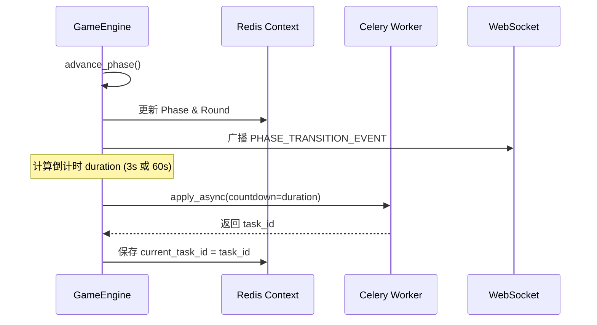
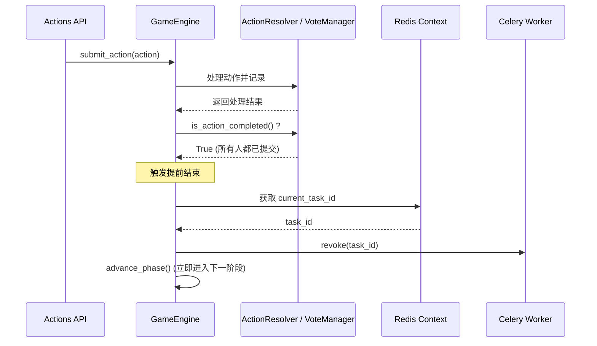

# 后台自动推进与提前结束机制设计

## 1. 背景与现状

在当前的实现中，游戏阶段的推进（Phase Transition）是由**前端驱动**的。前端在 `frontend/src/store/game.ts` 中维护了一个定时器（`startPhaseCountdown`），当倒计时结束时（如 3 秒或 60 秒），前端会主动调用后端的 `POST /api/games/{game_id}/advance` 接口来推进阶段。

**存在的问题：**
1. **架构不合理**：前端应仅作为展示层（View），不应承担游戏状态机的驱动责任。
2. **可靠性差**：如果前端断线、刷新页面或浏览器休眠，定时器可能失效，导致游戏卡死在某个阶段。
3. **无法实现“提前结束”**：如果所有玩家都提前提交了行动（例如狼人 10 秒内就统一了意见），系统依然要干等前端的 60 秒倒计时结束，严重影响游戏体验。

## 2. 改造目标

1. **后端接管定时器**：阶段推进的倒计时由后端 Celery 延迟任务（Delayed Task）接管。
2. **实现提前结束机制（Early Termination）**：当后端检测到当前阶段所需的所有动作已收集完毕时，立即取消定时任务，直接进入下一阶段。
3. **前端退化为纯展示层**：前端仅根据 WebSocket 推送的 `PHASE_TRANSITION_EVENT` 更新 UI 和重置本地倒计时动画，不再主动调用 `/advance` 接口。

---

## 3. 核心机制设计

### 3.1 Celery 延迟任务 (定时推进)

在 `GameEngine.advance_phase` 成功进入新阶段后，后端需要根据阶段类型计算倒计时，并向 Celery 投递一个延迟任务。

*   **倒计时规则**：
    *   `NIGHT_START` (黑暗降临) -> 3秒
    *   结算阶段 (`NIGHT_RESOLVE`, `VOTE_RESOLVE` 等) -> 3秒
    *   行动/投票/发言阶段 -> 60秒
*   **任务调度**：使用 `advance_phase_task.apply_async(args=[game_id, next_phase], countdown=duration)`。
*   **任务句柄保存**：为了支持后续的“提前取消”，必须将 Celery 返回的 `task_id` 记录到 Redis 的对局上下文中（例如 `HSET game:{game_id}:context current_task_id {task_id}`）。

### 3.2 动作收集与提前结束 (Early Termination)

在 `GameEngine.submit_action` 中，每次成功接收并处理玩家动作后，需要检查当前阶段的“预期动作”是否已全部收集完毕。

*   **预期动作完成的判断逻辑**：
    *   **狼人阶段 (`NIGHT_WOLF_ACT`)**：所有存活的狼人都已提交了 `WOLF_KILL` 动作。
    *   **女巫阶段 (`NIGHT_WITCH_ACT`)**：女巫已提交 `WITCH_SAVE`、`WITCH_POISON` 或明确的跳过动作。
    *   **预言家阶段 (`NIGHT_SEER_ACT`)**：预言家已提交 `SEER_CHECK` 动作。
    *   **投票阶段 (`DAY_VOTE`, `DAY_PK_VOTE`)**：所有存活且有投票权的玩家都已提交了投票。
*   **提前结束流程**：
    1.  如果判断动作已收集完毕，从 Redis 获取当前阶段的 `task_id`。
    2.  调用 Celery 的 API 取消定时任务：`celery_app.control.revoke(task_id, terminate=True)`。
    3.  立即在当前上下文中调用 `GameEngine.advance_phase()` 推进阶段。

### 3.3 并发控制与防重 (Concurrency Control)

由于 Celery 定时任务的触发和玩家提交最后一个动作触发的提前结束可能**同时发生**，必须引入并发控制，防止 `advance_phase` 被执行两次导致状态机跳跃。

*   **方案**：基于 Redis 的乐观锁或 Lua 脚本。
*   **实现**：在执行 `advance_phase` 前，校验当前 Redis 中的 `phase` 和 `round` 是否与任务预期的一致。如果不一致（说明已经被提前结束逻辑推进了），则 Celery 任务直接 return 放弃执行。

---

## 4. 详细流程图

### 4.1 阶段推进与定时器设定流程

### 4.2 动作提交与提前结束流程

---

## 5. 改造步骤 (Action Items)

### Step 1: 完善 Celery 任务
修改 `ai_werewolf_core/tasks/game.py` 中的 `advance_phase_task`，使其能够实例化 `GameEngine` 并调用 `advance_phase()`。增加并发防重校验逻辑。

### Step 2: 修改 GameEngine 推进逻辑
修改 `ai_werewolf_core/core/engine/game_engine.py` 的 `advance_phase` 方法。在方法末尾，根据 `next_phase` 计算倒计时，调用 `apply_async`，并将 `task_id` 存入 Redis。

### Step 3: 实现动作完成度检查
在 `ActionResolver` 和 `VoteManager` 中增加 `is_action_completed(current_phase, roles)` 方法，用于判断当前阶段的预期动作是否已全部就绪。

### Step 4: 修改 GameEngine 提交逻辑
修改 `GameEngine.submit_action`，在动作被 Manager 成功接收后，调用 `is_action_completed()`。如果返回 True，则执行 revoke 任务并主动调用 `advance_phase()`。

### Step 5: 前端改造
修改 `frontend/src/store/game.ts`：
1. 移除 `startPhaseCountdown` 中倒计时结束时调用 `gamesApi.advancePhase` 的逻辑。
2. 倒计时仅用于驱动 UI 进度条。
3. 阶段的切换完全依赖 `handleWsEvent` 中接收到的 `PHASE_TRANSITION_EVENT`。