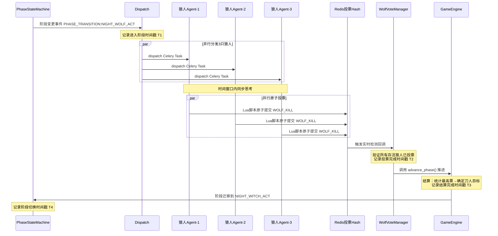
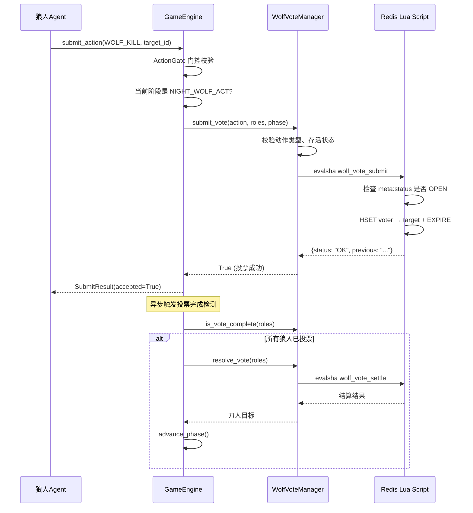
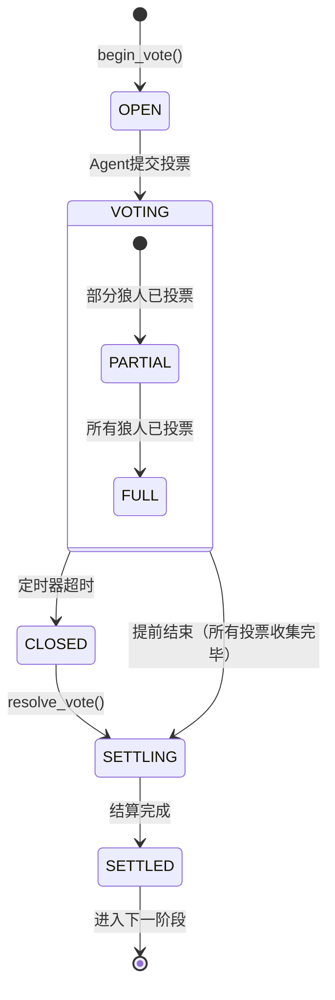
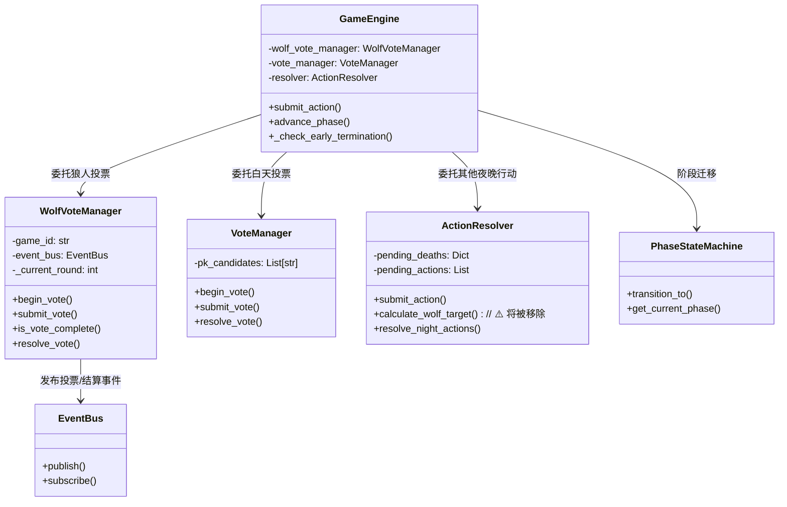

# 狼人并行投票与原子结算设计

## 1. 问题分析

### 1.1 当前架构的问题

现有代码中，狼人夜间行动（`NIGHT_WOLF_ACT`）存在以下问题：

1. **无同步机制**：三只狼人 Agent 各自独立提交 `WOLF_KILL` 动作到 [`ActionResolver.pending_actions`](ai_werewolf_core/core/engine/resolver.py:141)，彼此不知道对方正在投票，不能形成"同时思考、同时投票"的并行共识
2. **内存状态存储**：选票存储在进程内存的 `pending_actions` 列表中，多 Worker 部署下各进程状态不共享，存在竞态条件
3. **依赖定时器推进**：没有"所有狼人投票完毕立即结算"的实时检测机制，依赖 Celery 定时器倒计时到期才推进
4. **结算与推进分离**：`calculate_wolf_target()` 在 `advance_phase()` 中调用，结算后方可进入下一阶段，但缺乏"自动装填"下一阶段触发器的能力

### 1.2 核心需求

用户要求：
- ⏱ **强制三名队友同步进入思考状态**：三只狼人必须同时被唤醒，同时进入 LLM 推理
- 🗳 **同一时间窗口内并行投票**：所有狼人在同一时间窗口内提交选票
- 🔒 **原子提交**：选票写入必须是原子操作，防重、防丢失、防覆盖
- ⚡ **即时结算**：所有投票收集完毕后，立即触发结算，不等待定时器
- 🔄 **自动切换**：结算完成后自动无缝进入下一阶段（女巫阶段）
- 📝 **时间戳审计**：每一步记录精确时间戳

---

## 2. 整体架构设计

### 2.1 数据流图



### 2.2 新增模块与文件结构

```
ai_werewolf_core/
├── core/
│   ├── engine/
│   │   ├── wolf_vote_manager.py     # [新增] 狼人投票管理器
│   │   └── resolver.py              # [修改] 移除狼人投票相关逻辑
│   ├── engine/game_engine.py        # [修改] 集成 WolfVoteManager
│   └── event/bus.py                 # [修改] 无需修改，复用现有事件机制
├── redis_lua/
│   ├── wolf_vote_submit.lua         # [新增] 狼人原子投票脚本
│   ├── wolf_vote_check_complete.lua # [新增] 投票完成检测脚本
│   └── vote_submit.lua              # [未修改] 白天投票仍然使用现有脚本
├── tasks/
│   ├── dispatch.py                  # [修改] 狼人阶段并行分发逻辑优化
│   └── agent_tasks.py               # [未修改] Agent 运行逻辑不变
├── schemas/
│   └── enums.py                     # [未修改] 无需新增枚举
└── utils/
    └── redis_lua_loader.py          # [修改] 注册新的 Lua 脚本
```

---

## 3. 详细设计

### 3.1 狼人投票管理器 [`WolfVoteManager`](ai_werewolf_core/core/engine/wolf_vote_manager.py)

#### 3.1.1 Redis 数据模型

```text
Key: werewolf:wolf_vote:{game_id}:{round}   (Hash)
Fields:
  - voter_id → target_id (投票人 → 被投人，空字符串表示弃权)
  - meta:status → "OPEN" | "CLOSED" | "SETTLED" (投票状态)
  - meta:opened_at → ISO 时间戳 (投票开启时间)
  - meta:vote_start_at → ISO 时间戳 (所有狼人开始投票时间)
  - meta:vote_end_at → ISO 时间戳 (所有投票收集完毕时间)
  - meta:settled_at → ISO 时间戳 (结算完成时间)
TTL: 86400 秒 (24小时)
```

#### 3.1.2 核心接口

```python
class WolfVoteManager:
    """
    狼人投票管理器 —— 专职处理狼人夜间投票。
    
    与 VoteManager（白天投票）的区别:
    1. 只允许 WOLF_KILL 动作类型
    2. 只允许存活狼人投票
    3. 投票完成后立即触发结算+阶段推进
    4. 记录完整的时间戳审计链
    
    Redis 无状态设计，所有数据存储在 Redis Hash 中。
    """
    
    def __init__(self, game_id: str, event_bus: EventBus):
        self.game_id = game_id
        self.event_bus = event_bus
        self._redis = None  # 懒初始化
    
    def begin_vote(self, round_num: int) -> None:
        """
        开启新一轮狼人投票回合。
        
        执行操作:
        1. 设置当前轮次
        2. 写入 Redis Hash 初始化字段 `meta:status = "OPEN"`
        3. 记录 `meta:opened_at = now_tz()`
        4. 清理上一轮残留的投票数据
        
        Args:
            round_num: 当前游戏轮次。
        """
    
    async def submit_vote(self, action: AgentAction, roles: Dict[str, BaseRole], 
                          current_phase: GamePhase) -> bool:
        """
        原子提交狼人投票。
        
        校验顺序:
        1. 动作类型必须是 WOLF_KILL
        2. 投票人必须是存活狼人
        3. 投票状态必须为 OPEN（拒绝已关闭的投票回合）
        4. 通过 Lua 脚本原子写入 Redis Hash
        
        投票覆盖策略: 同白天投票一致，后提交的覆盖先提交的。
        
        Args:
            action: Agent 提交的投票动作。
            roles: 角色映射。
            current_phase: 当前阶段。
        
        Returns:
            True 表示选票已记录。
        """
    
    async def is_vote_complete(self, roles: Dict[str, BaseRole]) -> bool:
        """
        检测是否所有存活狼人已投票。
        
        实现:
        1. 统计存活狼人数量
        2. 统计 Redis Hash 中已投票的数量（忽略 meta:* 字段）
        3. 已投票数 >= 存活狼人数
        
        Returns:
            True 表示所有存活狼人已完成投票。
        """
    
    async def resolve_vote(self, roles: Dict[str, BaseRole]) -> Optional[str]:
        """
        结算狼人投票并返回刀人目标。
        
        结算逻辑:
        1. 从 Redis 拉取全量选票
        2. 统计每个目标的得票数
        3. 确定最高票:
           - 唯一最高票 → 返回该 player_id
           - 平票 → 返回 None（平安夜）
           - 无人投票（全弃权）→ 返回 None
        4. 更新 Redies Hash: meta:status = "SETTLED"
        5. 记录 meta:settled_at = now_tz()
        6. 发布投票结算事件 VOTE_EVENT
        
        Returns:
            被刀目标 player_id，或 None（平安夜）。
        """
```

#### 3.1.3 Lua 脚本设计

##### 脚本 1: [`wolf_vote_submit.lua`](ai_werewolf_core/redis_lua/wolf_vote_submit.lua)

```lua
-- wolf_vote_submit.lua
-- 狼人原子投票提交，带状态检测和重复投票检测。
--
-- KEYS[1]: 狼人投票 Hash Key
-- ARGV[1]: 投票人 ID
-- ARGV[2]: 被投目标 ID（空字符串表示弃权）
-- ARGV[3]: TTL（秒）
--
-- 返回值: {status, voter, previous_target}
--   status: "OK"（成功）| "CLOSED"（投票回合已关闭）| "NOT_VOTER"（非狼人）
--   voter: 投票人 ID
--   previous_target: 该投票人之前的投票目标（首次投票为 nil）

local key = KEYS[1]
local voter = ARGV[1]
local target = ARGV[2]
local ttl = tonumber(ARGV[3])

-- 检查投票回合是否已关闭
local vote_status = redis.call('HGET', key, 'meta:status')
if vote_status == 'CLOSED' or vote_status == 'SETTLED' then
    return {'CLOSED', voter, nil}
end

-- 记录选票
local previous = redis.call('HGET', key, voter)
redis.call('HSET', key, voter, target)
redis.call('EXPIRE', key, ttl)

-- 如果是首次投票，记录 meta 信息
if not previous then
    redis.call('HSET', key, 'meta:vote_count', redis.call('HLEN', key) - 1)
end

return {'OK', voter, previous or ''}
```

##### 脚本 2: [`wolf_vote_settle.lua`](ai_werewolf_core/redis_lua/wolf_vote_settle.lua)

```lua
-- wolf_vote_settle.lua
-- 原子结算狼人投票，带 CAS（Compare-And-Swap）语义。
-- 防止多 Worker 并发结算导致重复处理。
--
-- KEYS[1]: 狼人投票 Hash Key
-- ARGV[1]: 总狼人数（含可能已投票的狼人）
-- ARGV[2]: TTL（秒）
-- ARGV[3]: 当前时间戳（ISO 格式）
--
-- 返回值: {status, vote_count_json, vote_details_json}
--   status: "OK"（结算成功）| "ALREADY_SETTLED"（已结算）| "VOTES_PENDING"（投票未满）

local key = KEYS[1]
local total_wolves = tonumber(ARGV[1])
local ttl = tonumber(ARGV[2])
local timestamp = ARGV[3]

-- 检查是否已结算
local current_status = redis.call('HGET', key, 'meta:status')
if current_status == 'SETTLED' then
    return {'ALREADY_SETTLED', nil, nil}
end

-- 关闭投票回合（阻止新投票）
redis.call('HSET', key, 'meta:status', 'CLOSED')
redis.call('HSET', key, 'meta:vote_end_at', timestamp)
redis.call('EXPIRE', key, ttl)

-- 收集所有非 meta 字段的选票
local all_fields = redis.call('HGETALL', key)
local votes = {}
local vote_details = {}

for i = 1, #all_fields, 2 do
    local field = all_fields[i]
    local value = all_fields[i+1]
    -- 跳过 meta:* 字段
    if not string.match(field, '^meta:') then
        votes[value] = (votes[value] or 0) + 1
        vote_details[field] = value
    end
end

-- 打平到 JSON 字符串返回
local cjson = require 'cjson'
return {'OK', cjson.encode(votes), cjson.encode(vote_details)}
```

### 3.2 关键功能：原子提交与结算

#### 3.2.1 原子提交流程



#### 3.2.2 实时结算触发机制

在 [`GameEngine._check_early_termination()`](ai_werewolf_core/core/engine/game_engine.py:444) 中扩展：

```python
async def _check_early_termination(self, current_phase: GamePhase) -> None:
    """检查当前阶段是否满足提前结束条件。"""
    is_completed = False

    if current_phase in NIGHT_ACT_PHASES:
        if current_phase == GamePhase.NIGHT_WOLF_ACT:
            # 狼人阶段：使用 WolfVoteManager 检测
            is_completed = await self.wolf_vote_manager.is_vote_complete(self.roles)
        else:
            is_completed = self.resolver.is_action_completed(self.roles, current_phase)
    elif current_phase in VOTE_PHASES:
        is_completed = await self.vote_manager.is_action_completed(self.roles)

    if not is_completed:
        return

    # ── 记录投票完成时间戳 ──
    phase_ts_key = f"werewolf:wolf_vote:{self.game_id}:{await self.state_machine.get_round()}"
    ts_logger.info("wolf_vote_all_collected", 
                   game_id=self.game_id, 
                   timestamp=now_tz().isoformat())

    # 取消定时器并立即推进
    await self._cancel_and_advance()
```

#### 3.2.3 自动阶段推进

不再依赖 Celery 定时器作为主要推进手段，而是通过"投票完成 → 立即结算 → 自动推进"的链式触发：

1. 当 [`_check_early_termination`](ai_werewolf_core/core/engine/game_engine.py:444) 检测到所有狼人已投票
2. 调用 [`wolf_vote_manager.resolve_vote()`](ai_werewolf_core/core/engine/wolf_vote_manager.py) 结算投票
3. 调用 [`advance_phase()`](ai_werewolf_core/core/engine/game_engine.py:492) 推进到下一个阶段（`NIGHT_WITCH_ACT`）
4. Celery 定时器仅作为兜底保障（超时降级）

### 3.3 时间戳审计链

每条审计记录包含 5 个关键时间点：

| 时间点 | 含义 | 触发时机 |
|--------|------|----------|
| `T1: phase_entered_at` | 进入 NIGHT_WOLF_ACT 阶段 | `on_phase_transition` 事件处理 |
| `T2: wolf_dispatched_at` | 狼人 Agent 全部完成分发 | `dispatch.py` 分发所有狼人后 |
| `T3: vote_start_at` | 首张狼人选票提交 | `wolf_vote_submit.lua` 首次 HSET |
| `T4: vote_completed_at` | 全部选票收集完毕 | `is_vote_complete()` 返回 True |
| `T5: settled_at` | 结算完成 | `resolve_vote()` 完成 |

所有时间戳写入 Redis Hash：

```python
# 写入审计时间戳
audit_field = f"audit:{timestamp_label}"
await redis.hset(vote_key, audit_field, now_tz().isoformat())
```

### 3.4 需要修改的现有文件

#### 3.4.1 [`GameEngine`](ai_werewolf_core/core/engine/game_engine.py)

1. 在 `__init__` 中初始化 [`WolfVoteManager`](ai_werewolf_core/core/engine/wolf_vote_manager.py)
2. 修改 `submit_action` 方法，将 `NIGHT_WOLF_ACT` 路由到 [`wolf_vote_manager.submit_vote()`](ai_werewolf_core/core/engine/wolf_vote_manager.py) 而非 `resolver.submit_action()`
3. 修改 `_check_early_termination` 方法，为 `NIGHT_WOLF_ACT` 注册狼人投票完成检测
4. 修改 `_determine_next_phase` 方法，移除对 `resolver.calculate_wolf_target()` 的依赖

#### 3.4.2 [`ActionResolver`](ai_werewolf_core/core/engine/resolver.py)

1. 移除 `calculate_wolf_target()` 方法（逻辑迁移到 [`WolfVoteManager.resolve_vote()`](ai_werewolf_core/core/engine/wolf_vote_manager.py)）
2. 移除 `submit_action` 中对 `NIGHT_WOLF_ACT` 的处理分支
3. 移除 `_update_draft_deaths` 中对 `WOLF_KILL` 的处理分支

#### 3.4.3 [`dispatch.py`](ai_werewolf_core/tasks/dispatch.py)

1. 在 `on_phase_transition` 中，为 `NIGHT_WOLF_ACT` 添加记录阶段进入时间戳 `T1` 的逻辑
2. 分发完所有狼人后，记录分发完成时间戳 `T2`

#### 3.4.4 [`LuaScriptManager`](ai_werewolf_core/utils/redis_lua_loader.py)

1. 注册两个新的 Lua 脚本：`wolf_vote_submit` 和 `wolf_vote_settle`

---

## 4. 时序与超时策略



| 场景 | 触发方式 | 超时兜底 | 降级策略 |
|------|---------|---------|---------|
| 所有狼人按时投票 | `_check_early_termination` | Celery 60s 超时 | 超时后未投票狼人视为弃权 |
| 部分狼人离线 | 定时器到期后推进 | 强制结算 | 已投票狼人选票生效，未投票视为弃权 |
| 平票 | 结算时自动检测 | N/A | 返回 None（平安夜），自动推进 |

---

## 5. 与现有组件的集成关系



---

## 6. 实施步骤

### Step 1: 创建 [`WolfVoteManager`](ai_werewolf_core/core/engine/wolf_vote_manager.py)
- 实现 `begin_vote()`, `submit_vote()`, `is_vote_complete()`, `resolve_vote()` 方法
- 实现时间戳审计链
- 编写单元测试

### Step 2: 创建 Lua 脚本
- 创建 [`wolf_vote_submit.lua`](ai_werewolf_core/redis_lua/wolf_vote_submit.lua)
- 创建 [`wolf_vote_settle.lua`](ai_werewolf_core/redis_lua/wolf_vote_settle.lua)
- 在 [`LuaScriptManager`](ai_werewolf_core/utils/redis_lua_loader.py) 中注册

### Step 3: 修改 [`GameEngine`](ai_werewolf_core/core/engine/game_engine.py)
- 集成 [`WolfVoteManager`](ai_werewolf_core/core/engine/wolf_vote_manager.py)
- 修改 `__init__`, `submit_action`, `_check_early_termination`, `advance_phase`

### Step 4: 修改 [`ActionResolver`](ai_werewolf_core/core/engine/resolver.py)
- 移除 `calculate_wolf_target()` 方法
- 移除 `NIGHT_WOLF_ACT` 相关的处理分支
- 清理 `pending_actions` 中对 WOLF_KILL 动作的依赖

### Step 5: 修改 [`dispatch.py`](ai_werewolf_core/tasks/dispatch.py)
- 添加时间戳记录逻辑
- 优化狼人分发并行性和日志

### Step 6: 编写集成测试
- 测试三狼人并行投票场景
- 测试平票场景（无人被刀）
- 测试超时场景（部分狼人超时弃权）
- 测试时间戳审计链完整性
