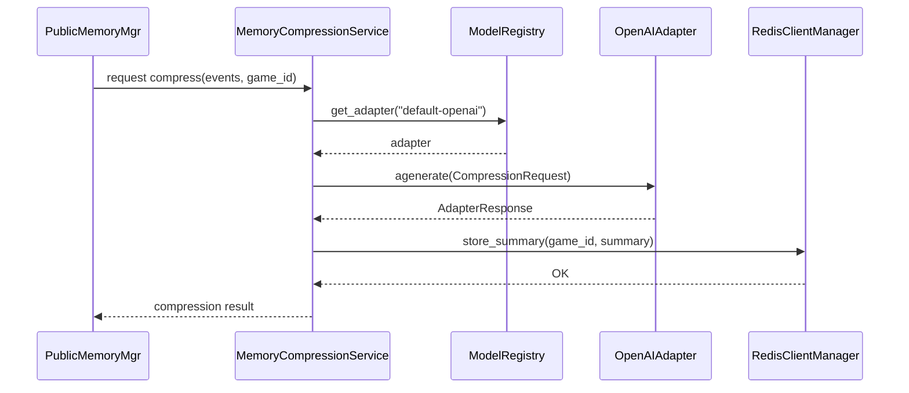

# Memory Compression 设计文档

## 1. 目标与背景

在 **AI Werewolf** 中，随着游戏回合数增加，公共记忆会迅速累积，最终导致 LLM 上下文窗口 Token 超限。在所有记忆中，**公共事实中的玩家发言最占 Token**。因此，记忆压缩的核心目标是**针对玩家发言进行压缩**，同时保留关键的游戏事实。

压缩后的记忆将采用**两段式结构**：
1. **发言概括**：每个玩家发言或遗言的简要概括。
2. **关键事实**：谁死了、谁被投票了、谁投的谁等客观事实。

压缩结果将按轮次（Round）存入 Redis 的 Hash 结构中，以便在构建 Prompt 时进行高效的“压缩记忆 + 近期全量记忆”的拼接。

## 2. 架构概览

```
+-------------------+        +-------------------+       +-------------------+
| PublicMemoryMgr   |  -->   | MemoryCompression|  -->  | Redis (summary)   |
+-------------------+        +-------------------+       +-------------------+
                                 |
                                 v
                         +-------------------+
                         | ModelRegistry    |
                         +-------------------+
                                 |
                                 v
                         +-------------------+
                         | OpenAIAdapter    |
                         +-------------------+
```

- **PublicMemoryMgr**：负责从 EventBus 拉取公共事件并组织为 `List[PublicEventLog]`。
- **MemoryCompressionService**（本设计核心）：组装压缩 Prompt，调用 `ModelRegistry` 获取已配置的 OpenAI 适配器，将 `full_prompt` 发送至 OpenAI，获得摘要。
- **ModelRegistry**：统一管理模型配置（从 `settings.models` 与 `model_config` 表同步），提供 `get_adapter(model_id)`。
- **OpenAIAdapter**：仅负责网络调用，返回 `AdapterResponse`（原始内容 + 解析结果）。
- **RedisClientManager**：将压缩后的摘要写入 `COMPRESSED_MEMORY_SUMMARY:{game_id}` 的 Hash 结构中，Field 为 `round`，Value 为该轮的压缩摘要。

## 3. 关键组件

| 组件 | 位置 | 主要职责 |
|------|------|----------|
| `MemoryCompressionService` | `ai_werewolf_core/agents/memory/compression.py`（或直接在 `pruner.py`） | 组装 `full_prompt`，调用适配器，处理异常回退，写入 Redis |
| `CompressionRequest` / `CompressionResponse` | `ai_werewolf_core/schemas/models.py` | API 输入/输出模型，`full_prompt`、`model_id`、`summary` 等字段 |
| API 路由 `memory_compression.py` | `ai_werewolf_core/api/routes/memory_compression.py` | 与前端交互：GET/POST 触发压缩、查询摘要，参考 `api/routes/models.py` |
| 常量 `COMPRESSED_MEMORY_SUMMARY` | `ai_werewolf_core/constant/redis_keys.py` | Redis 键前缀定义 |
| `ModelRegistry.reload()` | `ai_werewolf_core/agents/model/registry.py` | 动态刷新模型配置，确保新增模型通过 `/models` 接口可立即使用 |

## 4. 数据流与时序



> **注意**：时序图中所有方括号 `[]` 均不包含双引号或圆括号，以避免解析错误。

## 5. 实现要点

1. **`MemoryPruner.compress_events`**
   - 将单轮的 `events` 转换为结构化的 `full_prompt`。
   - **Prompt 要求两段式输出**：第一段概括玩家发言/遗言，第二段罗列死亡、投票等关键事实。
   - 调用 `ModelRegistry.get_adapter(model_id)` 获取已初始化的 `OpenAIAdapter` 实例。
   - 使用 `await adapter.agenerate(request)` 获得 `AdapterResponse`，若 `is_success=False` 记录警告并回退为简单拼接。
2. **Redis Hash 存储**
   - 键名 `COMPRESSED_MEMORY_SUMMARY:{game_id}`，数据结构为 **Hash**。
   - Field 为 `round`（轮次），Value 为该轮的两段式压缩摘要。
   - 使用 `await RedisClientManager.get_client()` 获取客户端后执行 `hset`。
   - 设定合理 TTL（例如 7 天）以防过时数据占用内存。
3. **API 路由**
   - `POST /memory/compress` 接收 `{ "game_id": "...", "model_id": "default-openai" }`，内部调用 `MemoryCompressionService`，返回 `{ "summary": "..." }`。
   - `GET /memory/summary/{game_id}` 返回已存储的摘要，若不存在返回 404。
4. **模型配置**
   - 前端通过已有的 `/models` 接口添加/更新 OpenAI 配置，随后 `ModelRegistry.reload()` 自动加载。
   - 为压缩服务提供专用 `model_id`（可复用 `default-openai`），无需额外字段。
5. **错误处理与回退**
   - 调用 OpenAI 超时或返回非 JSON 时，记录 `logger.error`，返回 `"fallback"`（直接拼接原始事件），并继续写入 Redis，保证系统不会因压缩失败而中断。
6. **安全**
   - `api_key` 在 `ModelConfig` 表中使用 `encrypt_api_key` 加密存储，`ModelRegistry` 读取时解密后注入适配器。

## 6. 与现有系统的交互

- **查询逻辑 (PromptBuilder / PublicMemoryManager)**：
  1. 每次在提示词构筑节点中获取公有事实时，先从 Redis Hash 中查询**全量的压缩记忆**（所有已压缩的轮次）。
  2. 获取压缩记忆中最大的轮次（`max_compressed_round`）。
  3. 然后，仅全量查询 `round > max_compressed_round` 的公有记忆（即最近未压缩的轮次）。
  4. 将“历史压缩记忆”与“近期全量记忆”拼接，注入到 LLM 的 Prompt 中。
- **触发时机**：
  - **Game Engine** 在每轮（Round）结束后，主动触发 `MemoryCompressionService`，对刚刚结束的那一轮的公共事件进行压缩，并存入 Redis Hash。

## 7. 配置与部署

1. 在 `.env` 中添加 OpenAI 配置（参考 `docs/plan/Memory_Compression_Design.md` 示例）
   ```
   MODEL_0_ID=default-openai
   MODEL_0_PROVIDER=openai
   MODEL_0_NAME=GPT-4 Turbo
   MODEL_0_API_KEY=${OPENAI_API_KEY}
   MODEL_0_BASE_URL=https://api.openai.com/v1
   MODEL_0_MODEL_NAME=gpt-4-turbo
   MODEL_0_TEMPERATURE=0.7
   MODEL_0_MAX_TOKENS=1024
   MODEL_0_TIMEOUT=15.0
   ```
2. 启动时 `FastAPI` `startup` 事件调用 `await ModelRegistry.init()`，确保模型已就绪。
3. 前端在需要压缩记忆时调用 `/memory/compress`，获取 `summary` 并在 UI 中展示或用于后续推理。

## 8. 关注点与风险

- **Latency**：OpenAI 调用会产生网络延迟，建议在压缩任务中使用异步后台任务（Celery）并对超时进行回退。
- **Token 限制**：对 `full_prompt` 长度进行预估，若仍超限则分段压缩或二次摘要。
- **Redis 容量**：压缩摘要体积较小，但频繁写入仍需监控内存使用，设置 TTL 防止长期累积。
- **模型费用**：使用 OpenAI API 产生费用，需要在配置中设定预算阈值并在异常时回退至本地拼接。

## 9. 未来扩展

- 支持 **多模型**（如 Anthropic Claude、智谱 Qwen）并在压缩请求中明确 `model_id`。
- 引入 **本地轻量模型**（如 `MiniGPT`），在部署离线环境时可通过 `LocalModelAdapter` 替代 OpenAIAdapter。
- 将压缩摘要同步到 **PostgreSQL**（可选）以支持对局历史审计。

---

*本文档已同步至 `docs/plan/Memory_Compression_Design.md`，供开发、评审与实现参考。*