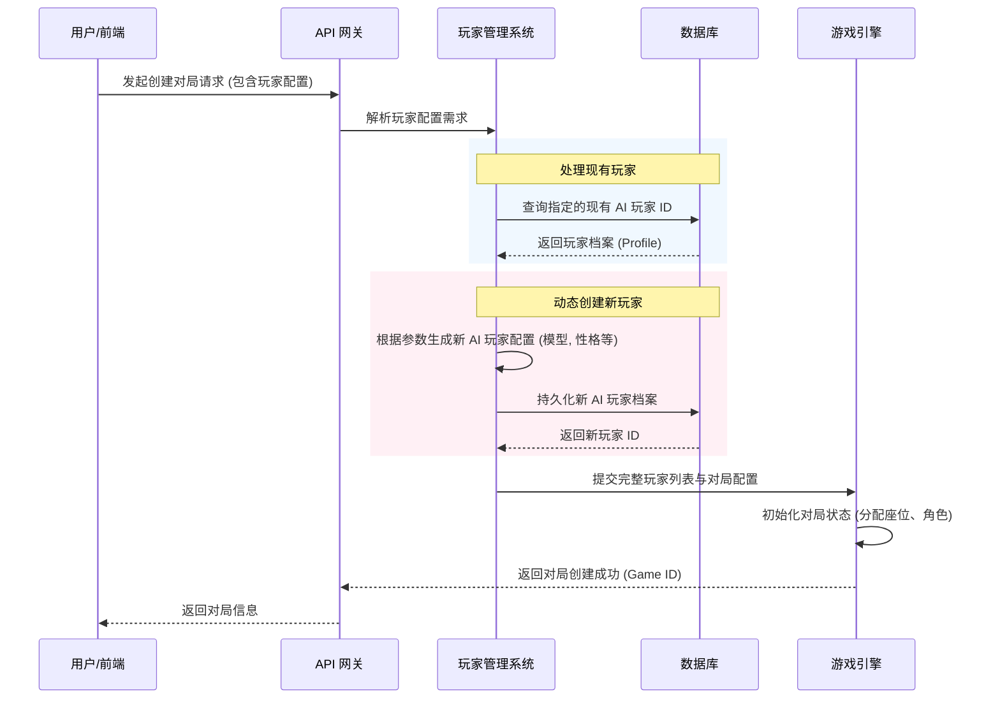
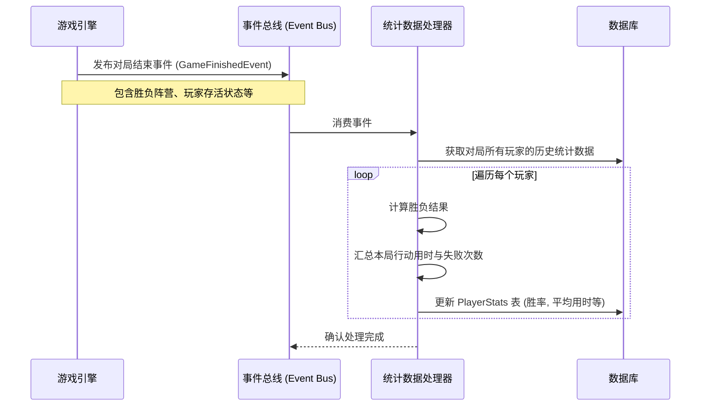

# 玩家管理系统详细设计文档

## 1. 系统背景概述

在 AI 狼人杀（AI Werewolf）项目中，玩家管理系统（Player Management System）是连接底层大语言模型（LLM）与上层游戏引擎（Game Engine）的关键桥梁。当前系统已经具备了基础的对局内玩家状态管理（如 `PlayerRecord` 和 `PlayerStatusManager`），但缺乏跨对局的、全局的 AI 玩家生命周期管理与数据沉淀。

本系统的核心目标是：
1. **资产化 AI 玩家**：将 AI 玩家从单次对局的临时实例，升级为具备独立身份、性格配置和历史战绩的持久化资产。
2. **灵活的对局构建**：在用户创建游戏开局时，支持从现有 AI 玩家库中挑选特定玩家，或根据需求动态生成全新的 AI 玩家加入对局。
3. **全方位数据追踪**：精确记录并持久化每个玩家的胜负局数、响应稳定性（失败次数）、性能指标（平均行动用时）等核心行为数据。
4. **赋能自进化**：在架构和数据结构上，为未来引入具备强化学习（RL）和上下文记忆（Contextual Memory）能力的自进化 Agent 打下坚实基础。

---

## 2. 核心业务流程图解描述

### 2.1 玩家选择与动态创建流程

在创建对局时，用户（或系统调度器）可以通过玩家管理系统构建对局阵容。



### 2.2 对局数据统计与追踪流程

对局结束后，系统通过事件总线（Event Bus）异步更新玩家的统计数据，确保不阻塞核心游戏流程。



---

## 3. 详细的数据模型实体设计

为了支持跨对局的玩家管理，需要在现有的 `GameRecord` 和 `PlayerRecord`（仅记录单局状态）之外，引入全局的 AI 玩家档案和统计模型。

### 3.1 AI 玩家档案表 (`ai_player_profiles`)

记录 AI 玩家的固有属性和配置。

| 字段名 | 类型 | 约束 | 描述 |
| :--- | :--- | :--- | :--- |
| `id` | String(19) | PK, 唯一 | 雪花算法全局唯一ID |
| `name` | String(64) | 索引 | 玩家显示名称（如 "理智的分析师"） |
| `avatar_url` | String(255) | 可空 | 玩家头像URL |
| `model_provider` | String(32) | | 模型提供商（如 openai, anthropic） |
| `model_name` | String(64) | | 具体模型版本（如 gpt-4-turbo） |
| `system_prompt` | Text | 可空 | 赋予该玩家的特定性格或行为准则 Prompt |
| `temperature` | Float | 默认 0.7 | 模型生成温度参数 |
| `is_active` | Boolean | 默认 True | 是否在玩家库中激活可用 |
| `created_at` | DateTime | | 创建时间 |
| `updated_at` | DateTime | | 更新时间 |

### 3.2 玩家统计数据表 (`ai_player_stats`)

精确记录并持久化玩家的核心行为数据，与 `ai_player_profiles` 是一对一关系。

| 字段名 | 类型 | 约束 | 描述 |
| :--- | :--- | :--- | :--- |
| `player_id` | String(19) | PK, FK | 关联 `ai_player_profiles.id` |
| `total_games` | Integer | 默认 0 | 参与的总对局数 |
| `wins` | Integer | 默认 0 | 获胜局数 |
| `losses` | Integer | 默认 0 | 失败局数 |
| `response_failures` | Integer | 默认 0 | 模型调用失败/超时/格式错误的累计次数 |
| `total_actions` | Integer | 默认 0 | 累计成功执行的行动次数 |
| `total_action_time_ms`| BigInt | 默认 0 | 累计行动耗时（毫秒），用于计算平均用时 |
| `role_stats` | JSONB | 默认 {} | 按角色统计的胜负数据（如 `{"seer": {"wins": 5, "games": 10}}`） |
| `last_played_at` | DateTime | 可空 | 最后一次参与对局的时间 |

*注：平均行动用时（Average Action Time）可通过 `total_action_time_ms / total_actions` 动态计算，无需冗余存储。*

---

## 4. 关键 API 接口定义

### 4.1 获取 AI 玩家列表
- **接口**: `GET /api/v1/ai-players`
- **描述**: 获取可用的 AI 玩家库，支持按胜率、场次排序。
- **查询参数**:
  - `page`, `size`: 分页参数
  - `sort_by`: 排序字段 (如 `win_rate`, `total_games`)
- **响应示例**:
  ```json
  {
    "total": 150,
    "items": [
      {
        "id": "1234567890123456789",
        "name": "逻辑大师",
        "model_name": "gpt-4-turbo",
        "stats": {
          "total_games": 100,
          "win_rate": 0.65,
          "avg_action_time_ms": 2500
        }
      }
    ]
  }
  ```

### 4.2 动态创建 AI 玩家
- **接口**: `POST /api/v1/ai-players`
- **描述**: 动态创建一个全新的 AI 玩家实例。
- **请求体**:
  ```json
  {
    "name": "激进的狼王",
    "model_provider": "openai",
    "model_name": "gpt-4o",
    "system_prompt": "你是一个非常激进的玩家，喜欢在第一天就强势带节奏...",
    "temperature": 0.9
  }
  ```

### 4.3 创建对局并指定玩家
- **接口**: `POST /api/v1/games/create-with-players`
- **描述**: 创建新对局，并允许混合使用现有 AI 玩家和动态生成的新玩家。
- **请求体**:
  ```json
  {
    "player_count": 6,
    "role_setup": ["villager", "villager", "seer", "witch", "werewolf", "werewolf"],
    "players": [
      { "type": "existing", "player_id": "1234567890123456789" },
      { "type": "existing", "player_id": "9876543210987654321" },
      { "type": "dynamic", "config": { "model_name": "claude-3-opus", "temperature": 0.5 } }
      // 未指定的座位将由系统从库中随机挑选填补
    ]
  }
  ```

---

## 5. 自进化 Agent 机制的架构演进规划

为了让 AI 玩家在不断的对局中“越玩越聪明”，玩家管理系统在底层设计上为未来的自进化（Self-Evolution）预留了演进路径。演进规划分为三个阶段：

### 阶段一：数据沉淀与基础画像（当前阶段）
- **目标**：建立完善的数据收集机制。
- **实现**：通过 `ai_player_stats` 表记录胜负、耗时、失败率等客观指标。
- **价值**：为后续的强化学习提供基础的 Reward 信号（胜负）和惩罚信号（响应失败、超时）。

### 阶段二：上下文记忆与经验提取（短期规划）
- **目标**：赋予 Agent 跨对局的长期记忆（Long-term Memory）。
- **架构扩展**：
  1. 引入 **经验库 (Experience DB)**：基于向量数据库（如 Milvus/Qdrant）。
  2. **复盘机制 (Reflection)**：对局结束后，启动后台 Celery 任务，利用 LLM 对该玩家的本局表现进行复盘，提取“经验教训”（Lessons Learned）。
  3. **记忆检索 (Retrieval)**：在新的对局中，Agent 在行动前，根据当前分配的角色和场上局势，从经验库中检索相关的历史经验，作为 Context 注入到 Prompt 中。
- **数据模型扩展**：新增 `ai_player_memories` 表/集合，关联 `player_id`。

### 阶段三：强化学习与策略微调（中长期规划）
- **目标**：实现模型权重的实质性进化或策略参数的自动寻优。
- **架构扩展**：
  1. **轨迹收集 (Trajectory Collection)**：将 Event Sourcing 中的事件流转化为标准的 RL 轨迹数据 `(State, Action, Reward, Next State)`。
  2. **参数寻优 (Hyperparameter Tuning)**：基于贝叶斯优化等算法，根据玩家的历史胜率，自动微调其 `temperature` 或 `system_prompt` 中的激进/保守权重。
  3. **模型微调 (SFT / RLHF)**：筛选出高胜率、高逻辑性的对局日志，构建高质量数据集，定期对开源模型（如 Llama-3）进行监督微调（SFT）或直接偏好优化（DPO），从而孵化出专精于狼人杀的垂类大模型。
