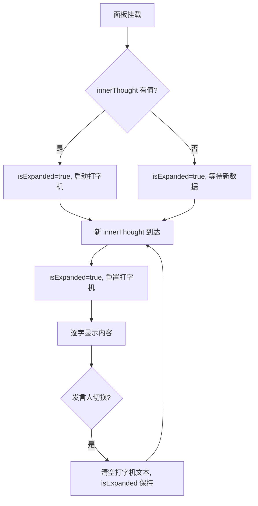
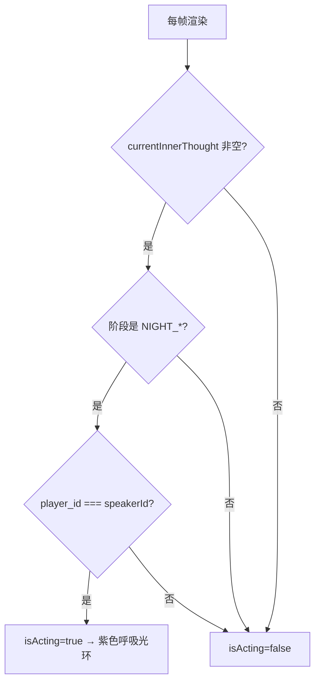

# 修复内心OS面板渲染 + 夜晚高亮方案

## 问题分析

### 问题1：内心OS面板默认最小化
- [`InnerOSPanel.vue`](../frontend/src/components/InnerOSPanel.vue:46) 中 `isExpanded = ref(false)`，面板默认折叠
- 第112行的 `watch(() => props.innerThought, ...)` **没有 `{ immediate: true }`**，所以如果组件挂载时 `innerThought` 已有值（如在回放中 seek 到某位置），watch 不会触发，面板保持折叠
- 第126行的 `watch(() => props.speakerId, ...)` 在新发言人出现时 **只停止打字机并清空文本，但不重置 `isExpanded`**，这导致当新发言人切换时，如果上一个面板是展开的，内容被清空但头部仍展开显示空白，视觉上表现为"面板展开但内容为空"

### 问题2：内心OS内容渲染
- `hasInnerThought` 计算属性（第59行）使用 `v-if` 控制整个面板显隐，条件为 `props.innerThought` 非空且长度>0，逻辑正确
- [`ReplayBoard.vue`](../frontend/src/components/ReplayBoard.vue:103-105) 的 `currentInnerThought` 只返回 `innerThought` 字符串，没有 speakerId 信息，但 speakerId 已从 store 的 `currentInnerThought` 获取，逻辑正常
- 但 [`ReplayBoard.vue`](../frontend/src/components/ReplayBoard.vue:142) 显示内心OS面板的条件包含 `!player.is_speaking` —— 这对于夜晚行动（PRIVATE_RESOLUTION_EVENT）是正确的，因为行动时玩家不是在"发言"
- **Bug**: [`ReplayBoard.vue`](../frontend/src/components/ReplayBoard.vue:88-92) 中 `innerThought` 的提取使用 `event.payload.inner_thought`，但 `payload` 字段可能是 JSON 字符串而非对象（取决于后端序列化方式），导致 `typeof event.payload.inner_thought === 'string'` 评估为 false

### 问题3：夜晚行动/思考角色高亮
- 目前 [`PlayerSeat.vue`](../frontend/src/components/PlayerSeat.vue) 只有 `isSpeaker` 高亮（发言光环）和存活状态灰度
- 没有任何组件或样式标记"当前正在夜晚行动/思考的AI玩家"
- 需要根据 `currentInnerThought?.speakerId` 和当前阶段是否为夜晚来添加高亮

## 修改方案

### 修改1：InnerOSPanel 默认展开
**文件**: [`frontend/src/components/InnerOSPanel.vue`](../frontend/src/components/InnerOSPanel.vue)

1. 将 `isExpanded` 默认值改为 `true`
2. 给 `innerThought` 的 `watch` 添加 `{ immediate: true }`，确保组件挂载时如果有 innerThought 则立即展开
3. 修改 `speakerId` 的 `watch`：切换发言人时仅重置打字机状态但**保持展开状态**（isExpanded 不受影响），仅当新 innerThought 到达时由上面第2点处理

### 修改2：修复内心OS内容渲染
**文件**: [`frontend/src/components/InnerOSPanel.vue`](../frontend/src/components/InnerOSPanel.vue)

4. 修复 `hasInnerThought` 对空字符串的处理：`innerThought` 为 `""` 时也视为无内容

**文件**: [`frontend/src/store/replay.ts`](../frontend/src/store/replay.ts)

5. 修复第88行的 `typeof event.payload.inner_thought === 'string'` 检查：`payload` 可能是 JSON 字符串，需先尝试 `JSON.parse`

### 修改3：夜晚行动玩家高亮
**文件**: [`frontend/src/components/PlayerSeat.vue`](../frontend/src/components/PlayerSeat.vue)

6. 新增 `isActing` prop（`boolean`，默认 `false`）
7. 在样式类中添加 `.player-seat--acting` 高亮样式：使用蓝色/紫色呼吸光环（区别于发言的金色）

**文件**: [`frontend/src/views/GameBoard.vue`](../frontend/src/views/GameBoard.vue)

8. 遍历左右玩家时，添加 `:is-acting` prop 绑定：当 `store.currentInnerThought?.speakerId === player.player_id` 且当前阶段为夜晚（`store.phase?.startsWith('NIGHT_')`）时传 `true`

**文件**: [`frontend/src/components/ReplayBoard.vue`](../frontend/src/components/ReplayBoard.vue)

9. 同样添加 `:is-acting` prop 绑定：条件为 `store.currentGameState.currentInnerThought?.speakerId === player.player_id` 且 `store.currentGameState.currentPhase?.startsWith('NIGHT_')`

## 状态流转图

## 夜晚高亮判定逻辑

## 影响范围

| 文件 | 修改类型 | 风险 |
|------|---------|------|
| `frontend/src/components/InnerOSPanel.vue` | 逻辑修改 | 低 — 仅改默认值和 watch 配置 |
| `frontend/src/components/PlayerSeat.vue` | 新增 prop + 样式 | 低 — 向后兼容，默认不启用 |
| `frontend/src/views/GameBoard.vue` | 模板添加 prop | 低 — 仅新增绑定 |
| `frontend/src/components/ReplayBoard.vue` | 模板添加 prop | 低 — 仅新增绑定 |
| `frontend/src/store/replay.ts` | 修复 JSON 解析 | 中 — 需确认 payload 格式 |
